# 自适应 NetCDF/HDF/TIFF 到 Zarr 转换器工作流

本文档记录当前转换器的完整工作流程，包括源文件自带时间维度和根据文件名构建时间维度两种模式。

## 1. 总体目标

转换器的统一目标是：

- 扫描一批具有共同数据结构的源文件；
- 检查变量、网格、时间和元数据的一致性；
- 根据用户选择裁剪时间、纬度、经度和变量；
- 自动选择适合源文件、CPU、内存和磁盘的写入计划；
- 将结果写为 Zarr v3；
- 写入后进行坐标、维度和源数据抽样校验。

输出数据优先统一为：

```text
dimensions: (time, lat, lon)
time coordinate: YYYY-MM-DD
```

当源文件使用其他维度名时，内部仍会映射为 `time/lat/lon`，输出 Zarr 始终使用标准名称。
无论源数据使用源时间、年 + DOY 还是年 + 月 + 日，输出 `time` 都统一转换为
日期型坐标并按 `YYYY-MM-DD` 表示。例如 `2001001` 输出为 `2001-01-01`。

## 2. 启动和自动模式识别

直接运行 `convert.py` 后，用户首先输入源目录和输出目录。程序不再要求用户先
手动选择转换模式，而是根据文件格式和首个文件的维度自动判断处理路径：

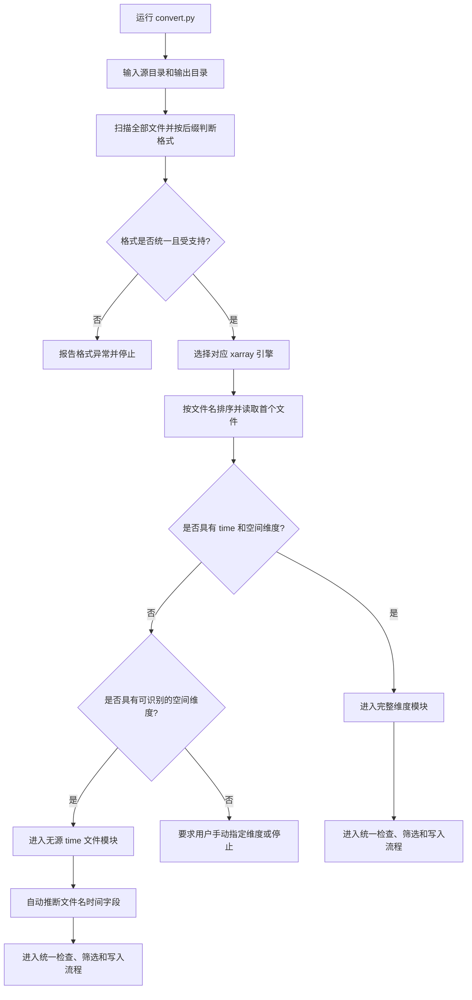

命令行模式仍可用于自动化运行，也支持显式指定：

```text
--mode complete
--mode filename
```

其中 `--mode` 是覆盖自动判断的高级选项；正常交互流程优先使用自动识别结果。

## 3. 文件格式识别和首文件判断

程序先扫描目录内的文件，要求同一批次使用统一后缀。格式和默认引擎为：

| 后缀 | 默认引擎 | 说明 |
|---|---|---|
| `.nc/.nc4/.nc3/.cdf` | `h5netcdf`，失败时尝试 `netcdf4` | NetCDF 数据 |
| `.hdf` | `netcdf4` | HDF 数据 |
| `.tif/.tiff` | `rasterio` | GeoTIFF 数据 |

随后程序按文件名排序，读取第一个文件并检查：

- 是否存在时间维度；
- 是否存在一维纬度和经度维度或可识别的 `x/y` 栅格维度；
- 变量、坐标和属性的基本结构。

如果首文件使用 `latitude/longitude` 等非标准名称，则建立源维度到
`time/lat/lon` 的映射。若自动识别失败，再要求用户手动输入实际名称。

## 4. 模块一：源文件具有完整时间和空间维度

这是当前已经实现的主要流程。

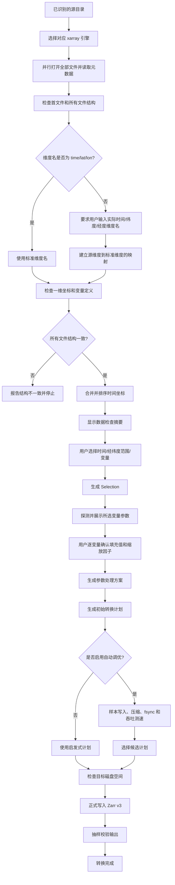

### 4.1 源维度标准化

源文件可以使用例如：

```text
(time, latitude, longitude)
```

只有自动识别失败时，交互模式才要求用户输入：

```text
时间维度：time
纬度维度：latitude
经度维度：longitude
```

内部转换为：

```text
源维度：time, latitude, longitude
标准维度：time, lat, lon
```

读取源文件时使用源维度，创建输出 Zarr 时使用标准维度。

## 5. 模块二：根据文件名构建时间维度

该模式用于源文件没有 `time` 维度，但每个文件代表一个时间切片的情况，例如：

```text
GLASS04B01.V42.A2001001.2020313.hdf
GLASS04B01.V42.A2001005.2020313.hdf
GLASS04B01.V42.A2001009.2020313.hdf
```

整体流程为：

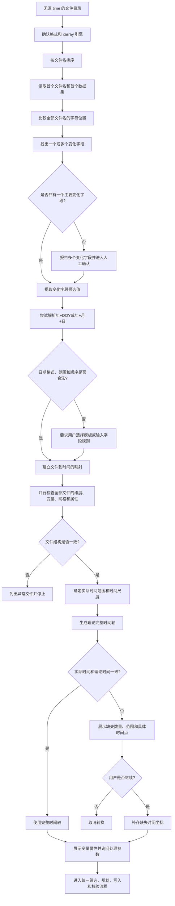

自动推断只能确定“文件名中哪些位置发生变化”，不能在所有情况下唯一判断
变化字段的语义。因此程序必须对候选字段执行日期合法性、时间顺序、重复时间和
时间间隔验证；若仍无法确定，再要求用户手动选择模板或指定字段位置。

时间字段确定后，程序再使用多进程读取全部源文件的元数据，统一核对维度、变量、
数据类型、经纬度网格以及变量属性。只有元数据检查通过后，才进入填充值、缩放
因子和空间/时间范围筛选流程。

对于文件名时间模式且源引擎为 `netcdf4` 的 NetCDF/HDF 文件，核对阶段优先使用
`netCDF4.Dataset` 低层接口读取维度、变量名、dtype、shape、`_FillValue`、
`missing_value`、`scale_factor`、`add_offset`、`units` 以及 HDF-EOS 的
`StructMetadata.0` 网格边界。首文件仍通过 xarray 完成标准化并生成 `lat/lon`，
后续文件只读取必要的元数据和坐标网格哈希；不适用的文件自动回退到原有 xarray
路径。该路径减少 Python/xarray 对象和不必要数组读取，但不能消除机械硬盘逐文件
寻道造成的等待。

### 5.1 年 + DOY 模板

程序优先从文件名变化字段中自动识别四位年份和三位 DOY。例如：

```text
年份字符串：2001
DOY 字符串：001
```

程序识别得到：

```text
2001001
```

程序根据全部文件名中相同的字段位置建立时间字段。日期转换规则为：

```text
date(year, 1, 1) + (DOY - 1) 天
```

程序必须检查 DOY 是否符合年份要求：

```text
普通年：1 <= DOY <= 365
闰年：  1 <= DOY <= 366
```

当前数据的示例规则：

```text
CSIF:
  OCO2.SIF.clear.inst.2001001.v2.nc

GLASS-PAR:
  GLASS04B01.V42.A2001001.2020313.hdf

GOSIF-GPP:
  GOSIF_GPP_2001001_Mean.tif
```

如果自动识别不到明确的四位年份 + 三位 DOY，才向用户询问年份字段、DOY
字段或字段位置。

### 5.2 年 + 月 + 日模板

如果变化字段能够解析为连续的八位日期，程序尝试识别年 + 月 + 日：

```text
年份字符串：2001
月份字符串：01
日期字符串：01
```

第一版优先支持连续日期字符串：

```text
20010101
```

后续可以扩展支持：

```text
2001-01-01
2001_01_01
```

若自动解析失败，程序再要求用户手动选择年、月、日字段，或输入明确的字段
规则。所有候选日期都必须通过日历合法性和时间顺序检查。

## 6. 文件名规则一致性和唯一性

程序使用排序后的全部文件名推断变化字段，并以首个文件名作为位置参考，随后对
全部文件执行二次验证。

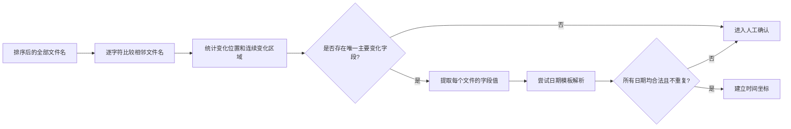

例如：

```text
GLASS04B01.V42.A2001001.2001001.hdf
```

如果 `2001001` 出现两次，或者多个变化字段都可以解释为日期，程序无法判断
哪个字段是数据时间，必须停止并要求用户人工确认字段位置、时间模板或正则规则。

这里的一致性指“时间字段位置、字段长度和文件名整体结构一致”，不要求整个
文件名的非时间内容完全相同。比如 GLASS 文件后面的处理日期可以变化，但
`A + 年DOY` 的位置和长度必须保持一致。

字符差分只能发现变化位置，不能单独证明其语义。程序还必须结合日期合法性、
时间排序、主导时间间隔和模板匹配结果进行确认。

字符差分的基本规则为：

- 首先检查文件名长度、扩展名和固定结构是否一致；
- 比较相邻文件名的每一个字符位置，记录发生变化的位置；
- 将连续变化位置合并为候选字段，并提取该字段在全部文件中的值；
- 对候选字段组合执行日期模板解析；
- 如果处理日期、版本号等字段也发生变化，则保留多个候选并转入人工确认，不能仅凭变化幅度直接判定时间字段。

## 7. 实际时间轴和理论时间轴一致性

文件名时间解析完成后，不能只使用实际存在的文件时间。转换器还需要根据实际时间范围和时间尺度生成理论完整时间轴，并比较两者是否一致。

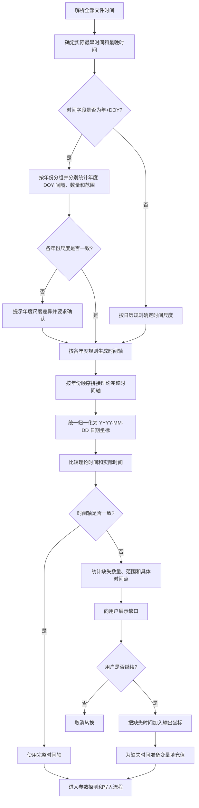

例如，用户确认数据为 1 日尺度时：

```text
实际范围：2001-01-01 -> 2022-12-31
理论时间点：8035
实际文件：7950
缺失时间点：85
```

程序应展示类似信息：

```text
检测到时间缺失：
  理论时间点：8035
  实际文件数：7950
  缺失时间点：85

示例缺口：
  2001-06-01 -> 2001-08-01

是否继续转换并为空缺时间创建数据？[y/N]
```

默认选择应为“不继续”，避免用户在没有确认的情况下生成带有空时间切片的结果。

如果用户选择继续，输出 `time` 坐标必须使用理论完整时间轴，而不是只使用实际文件时间。缺失时间对应的变量数据使用有效的缺失值填充，已有文件对应的数据保持不变。

时间尺度处理规则：

- 当前版本最低支持 1 日尺度；小时、分钟、秒等日内数据暂不支持；
- 对 1 日、1 月等规则时间轴，可以直接根据起止时间生成理论序列；
- 对年 + DOY 产品，必须先按年份独立统计 DOY 间隔、数据数量和范围，跨年份间隔不参与尺度推断；
- 不能简单使用全局最小时间间隔作为时间尺度，应优先使用各年度的主导间隔，并检查缺失造成的 2 倍、3 倍间隔；
- 对 4 日、8 日等按年度 DOY 排布的产品，应按每一年的 DOY 周期生成年度时间轴，再按年份拼接，不能机械地对整个时间范围使用固定 `timedelta`；
- 如果不同年份推断出的尺度不同，必须提示用户确认，不能静默合并为一个全局尺度；
- 发现重复时间、无法解析时间或时间尺度不明确时，应在正式写入前停止。

例如 CSIF 应得到类似的年度统计：

```text
2001: 92 个文件，主导间隔 4 天
2002: 92 个文件，主导间隔 4 天
2003: 92 个文件，主导间隔 4 天
```

`2001-DOY365` 到 `2002-DOY001` 的跨年日期差不用于判断尺度；年度时间轴
生成后再进行拼接。

输出时间坐标规则：

- 所有时间统一转换为日期型坐标，并按 `YYYY-MM-DD` 表示；
- 年 + DOY 的 `2001001` 转换为 `2001-01-01`，`2001365` 转换为 `2001-12-31`；
- 源时间若带有时分秒，当前版本只保留日期并归一化到当天零点；
- 如果同一天存在多个源时间点，可能产生重复日期，必须在写入前停止并提示用户。

缺失时间切片的填充值需要结合变量类型处理：浮点变量可以使用 `NaN`，整型变量应优先使用源文件的 `_FillValue` 或 `missing_value`；如果没有可用缺失值，则要求用户指定，或明确将输出升级为浮点类型。

## 8. 参数信息探测和用户处理

不同源数据可能使用不同的参数属性表示缺失值和缩放关系。转换器需要在确定所选变量后读取并展示这些信息，包括：

```text
_FillValue
missing_value
scale_factor
```

检测到的参数只作为提示和参考，不应在用户未确认时自动执行处理。用户输入的参数优先级高于源文件中检测到的同类参数。`add_offset` 等相关属性可以一并展示，但当前交互只要求用户确认填充值和缩放因子。

```mermaid
flowchart TD
    A[读取所选变量的 attrs 和 encoding] --> B[探测 _FillValue、missing_value、scale_factor、add_offset]
    B --> C[按变量展示检测结果]
    C --> D[询问填充值列表]
    D --> E{是否直接回车或输入 []?}
    E -- 是 --> F[不执行缺失值替换]
    E -- 否 --> G[解析任意长度的数值列表]
    G --> H{列表格式是否合法?}
    H -- 否 --> I[提示重新输入]
    H -- 是 --> J[记录有效填充值列表]
    F --> K[询问缩放因子]
    J --> K
    K --> L{是否直接回车?}
    L -- 是 --> M[不执行缩放]
    L -- 否 --> N[解析单个数值缩放因子]
    N --> O{是否为单个合法数值?}
    O -- 否 --> P[拒绝列表或多值输入]
    O -- 是 --> Q[记录有效缩放因子]
    M --> R[生成变量参数处理方案]
    Q --> R
```

### 8.1 填充值输入规则

填充值输入格式为 Python 列表，例如：

```text
[-1, 999, -999]
```

列表元素数量不限制。列表中的每个值都将被视为源数据中的缺失值候选。

```text
直接回车 → 不执行缺失值替换
输入 []   → 等同于不执行缺失值替换
```

填充值应按照原始数据值判断，并且应在缩放操作之前处理。例如：

```text
原始值：-1
填充值：[-1]
缩放因子：0.01
```

此时 `-1` 应先被识别为缺失值，不能先缩放成 `-0.01` 后再判断。

### 8.2 缩放因子输入规则

缩放因子只能输入一个数值，例如：

```text
0.01
1000
-2.5
```

其含义为：

```text
有效原始数据 = 原始数据 * 缩放因子
```

```text
直接回车 → 不执行缩放
[0.01]    → 非法，应输入单个数值
0.01 0.02 → 非法，应输入单个数值
```

### 8.3 参数处理顺序和属性更新

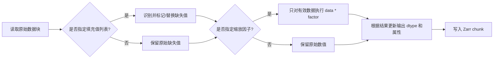

需要遵循以下规则：

- 检测到的 `_FillValue`、`missing_value` 和 `scale_factor` 先展示给用户；
- 用户输入为空时，不应偷偷套用检测到的参数；
- 用户输入的填充值列表和缩放因子是本次转换的有效处理参数；
- 如果手动缩放已经执行，输出中不能继续保留会导致二次缩放的旧 `scale_factor`；
- 如果没有执行手动处理，则可以保留源文件中的相关属性；
- 整型变量不能直接写入 `NaN`，缺失值替换时必须保留可表示的缺失标记，或明确升级为浮点类型；
- 原始参数和最终生效参数都应记录到输出属性或转换摘要中。

示例：

```text
GLASS：检测到 _FillValue=-1，scale_factor=0.01
用户输入：填充值 [-1]，缩放因子 0.01
处理结果：-1 作为缺失值，其余原始值乘以 0.01

CSIF：检测到 missing_value=-9999
用户输入：填充值 [-9999]，缩放因子留空
处理结果：识别 -9999 为缺失值，不改变其他有效值
```

## 9. 文件格式和读取后端

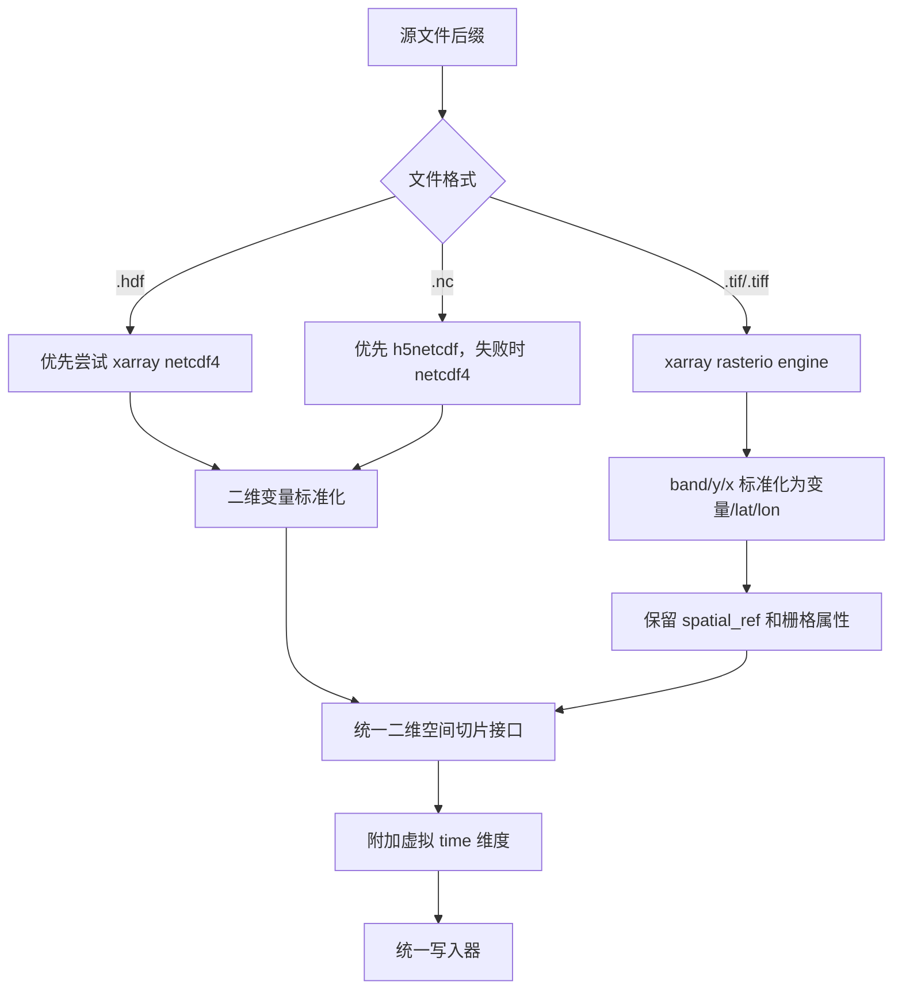

同一批次如果混有多个后缀，默认拒绝直接合并；用户应先分组处理，或明确提供
兼容的手动配置。

当前已确认的样例结构：

| 数据 | 读取后端 | 典型结构 |
|---|---|---|
| CSIF NetCDF | `netcdf4` | 二维变量和 `lat/lon` 坐标 |
| GLASS HDF | `netcdf4` | 无源 `time` 的二维变量 |
| GOSIF GeoTIFF | `rasterio` | `(band, y, x)` 和 `spatial_ref` |

TIFF 数据需要将长度为 1 的 `band` 维度处理掉，并将 `x/y` 映射到标准 `lon/lat`。同时需要确认 `rasterio` 后端是否进行了 mask、scale 或 dtype 转换，避免 UInt16 源数据被无意写成 Float32。

## 10. 统一数据模型

无论源文件是否存储 `time`，转换器内部都使用统一的逻辑模型：

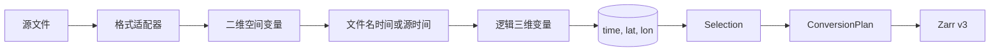

对于没有源时间维度的文件：

```text
file_2001001.tif → time = 2001-01-01
file_2001005.tif → time = 2001-01-05
```

这样可以继续复用现有的：

- 时间范围选择；
- 纬度和经度范围选择；
- 文件优先和 chunk 优先策略；
- 自动调优；
- 磁盘容量估算；
- Zarr 写入和抽样验证。

## 11. 规划和写入

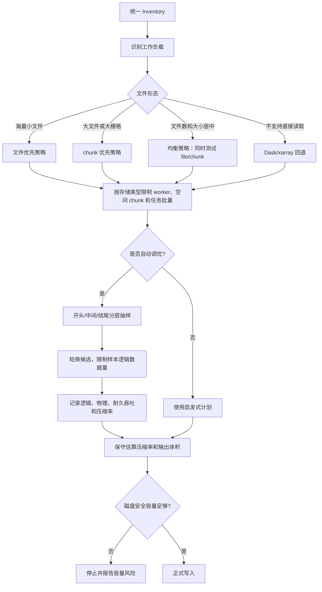

无时间维度的文件通常按“一个文件对应一个时间切片”处理。对于 TIFF，应尽量按照源 block 对齐空间 chunk；对于未分块的 HDF 栅格，则应避免对同一个文件发起大量随机读取。

如果用户确认补齐缺失时间，逻辑数据量、chunk 数量、自动调优样本和目标磁盘容量估算都必须按照理论完整时间轴计算，而不是按照实际文件数计算。

文件名时间模式与完整时间维度模式使用同一套自动调优流程：在正式写入前对候选
worker、时间/空间 chunk、任务批量和压缩配置进行分层小样本实测。大文件、海量小文件
和均衡型输入使用不同的候选范围；同一机械硬盘上的源/目标会限制随机 I/O 并发。
调参阶段记录逻辑吞吐、物理吞吐和包含 `fsync` 的耐久吞吐，正式方案默认按逻辑吞吐
选择，并额外预留压缩率波动安全裕量。正式写入时使用多进程，并显示实时进度、吞吐率
以及可用时的 CPU/RSS 监测信息。

## 12. 输出与校验

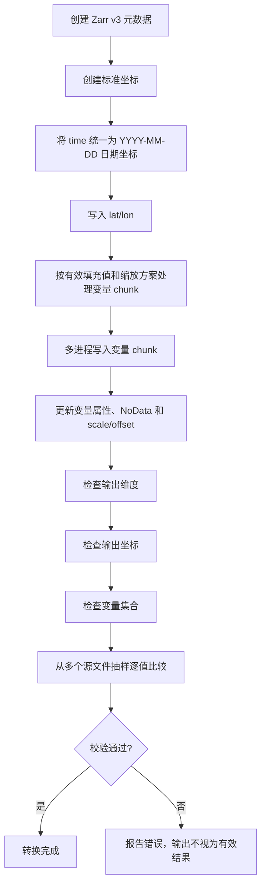

输出属性应与实际处理结果一致：

- `time` 坐标统一使用日期型 `YYYY-MM-DD` 表示，不保留源文件的 DOY 格式；
- NetCDF/HDF 的 `_FillValue`、`missing_value`、`scale_factor`、`add_offset`；
- TIFF 的 NoData、CRS、空间变换和波段属性；
- 文件名时间解析规则和源格式信息写入 Zarr 全局属性。

如果用户没有输入填充值或缩放因子，默认保留原始数值和相关源属性；如果用户明确执行了填充值识别或缩放，则必须同步更新输出属性，避免下游程序再次执行同一操作。

如果启用了缺失时间补齐，还要检查理论时间轴是否连续，以及每个缺失时间切片是否确实使用了有效缺失值。

## 13. 安全策略

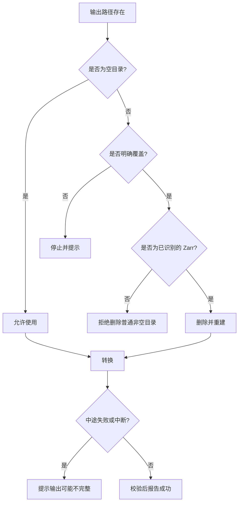

## 14. 当前状态

### 已实现

- NetCDF 批量检查和结构一致性验证；
- 源维度名到 `time/lat/lon` 的映射；
- 时间、纬度、经度和变量筛选；
- 文件优先、chunk 优先和 Dask 回退路径；
- 基于目标文件系统的样本调优；
- Zarr v3 写入、磁盘空间检查和抽样校验；
- 标准维度和非标准维度端到端测试。

### 已实现扩展

- 探测并展示 `_FillValue`、`missing_value`、`scale_factor` 等参数；
- 支持任意长度填充值列表和单个缩放因子输入；
- 比较实际时间范围和理论时间范围，并在确认后补齐缺失时间切片；
- 对缺失时间切片使用变量类型兼容的空值或缺失值；
- 启动时选择完整维度模式或文件名时间模式；
- 年 + DOY 文件名时间模板；
- 年 + 月 + 日文件名时间模板；
- 从样例文件名交互式定位时间字符串；
- 对全部文件执行唯一匹配和时间合法性检查；
- 无源 `time` 维度数据的虚拟时间轴；
- `.hdf` 和 `.tif/.tiff` 的自动后端选择；
- TIFF `band/y/x` 到标准变量和 `lat/lon` 的标准化。

### 待实施的流程精简

- 取消常规交互中的手动模式菜单，改为读取首文件后自动判断模块；
- 根据文件后缀自动选择 xarray 引擎，并拒绝未确认的混合格式批次；
- 使用全部文件名的字符差分自动推断变化字段；
- 自动尝试年 + DOY、年 + 月 + 日模板，并通过日期合法性、顺序和间隔校验；
- 自动识别失败时支持人工指定字段或正则规则；
- 只有在变化字段不唯一、日期模板有歧义或结构不一致时，才要求用户手动确认。
