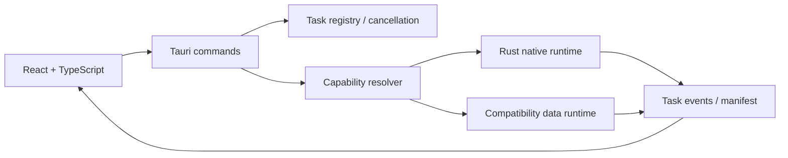

# v1.7.2 Native-first 当前开发状态

> 更新时间：2026-08-13
>
> 当前版本：`1.7.2`
>
> 当前桌面前端：Tauri 2 + React 19 + TypeScript

## 当前结论

Tauri + TypeScript 已成为唯一桌面前端。旧 PySide6 GUI、`gui.py`、Qt path picker、GUI 专属 worker 和旧 GUI 测试已经删除。

Python 数据处理服务没有被误删：它仍作为 Tauri Rust 内部的兼容执行路径，负责尚未通过 native 正确性门的科学数据能力。前端只访问 typed Tauri commands，不访问兼容服务进程或内部 Python 模块。

## 当前架构



## 已完成能力

### 桌面前端

- 总览工作台；
- 数据源检查和时间规则确认；
- Zarr native inspection 入口；
- pipeline builder；
- 重采样、重分块和重压缩参数配置；
- Auto/native execution policy；
- 计划预览；
- 任务历史、资源快照、事件流和取消；
- checkpoint 检查和任务恢复；
- 收藏路径和最近路径；
- capability matrix 可视化；
- 浏览器预览模式和 Tauri desktop runtime 检测。

### Tauri/Rust runtime

- 统一 command/request/response 边界；
- task registry；
- dedicated task event stream；
- accepted、started、resource、progress、log、finished、failed、cancelled 事件；
- 独立 cancellation handle；
- CPU 和内存资源快照；
- native operation capability matrix；
- staging、校验和原子发布；
- pipeline recovery command；
- sidecar 和开发环境兼容处理服务启动。

### Rust native Zarr

- Zarr v3 inspection；
- Float32/Float64 chunk 和 region 读写；
- Float32/Float64 array write；
- 单变量三维 Float32/Float64 重分块；
- 有界并行；
- 取消和 progress；
- 源 codec 保留；
- Rust/Python cross-backend fixture；
- capability schema 和 golden fixture。

## 明确的兼容边界

以下操作当前不宣称为 native：

- 标准 NetCDF native conversion；
- HDF-EOS 元数据恢复；
- TIFF/GeoTIFF 复杂读取；
- 非标准 calendar 和文件名时间轴；
- 多变量 native publish；
- 整数 dtype 的 native finalization；
- coordinate/data-variable 语义扩展；
- fill/scale/CF 属性转换；
- 自动压缩候选和复杂 codec；
- conservative/patch 等复杂重采样；
- 完整科学结果 validation oracle。

这些操作由兼容运行时完成，实际路径、限制和原因必须写入 capability、manifest 或事件。

## 当前命令

```bash
# 桌面开发
pixi run gui

# 前端检查
pixi run desktop-typecheck
pixi run desktop-build

# 完整 Python/兼容路径回归
pixi run test

# Rust workspace 回归
pixi run rust-test
```

## 当前测试边界

- `tests/test_application_services.py`：application services、快照、转换和服务级 native adapter；
- `tests/test_pipeline.py`：pipeline planner、执行、恢复和发布；
- `tests/test_native_smoke.py`：native capability、cross-backend、dtype、取消和 fallback；
- `tests/test_desktop_worker.py`：兼容处理服务 IPC；
- `tests/test_contracts.py`：request/event/capability 合同；
- 其他模块测试覆盖 filename mode、metadata、resampling、rechunking、runtime publication 和资源边界。

## 后续 native 路线

1. 多变量、整数 dtype 和属性语义的 Rust/Zarr parity；
2. 标准 NetCDF/HDF/TIFF reader 的真实数据 A/B；
3. 基础规则网格 native resampling；
4. Rust validation 与 recovery canonicalization；
5. 跨平台 ABI、sidecar 和发布包验证；
6. 对每个 capability 通过正确性、取消、异常安全和性能决策门；
7. 最后再删除对应兼容路径，而不是先删除 Python 数据能力。

## 删除原则

- 不删除仍被 Tauri compatibility runtime 使用的数据处理服务；
- 不用 capability 声明替代真实数据校验；
- 不把兼容执行伪装成 native 成功；
- 不保留第二套桌面前端入口；
- 不保留旧 GUI、旧 wrapper、旧 GUI 测试或历史架构资料。
