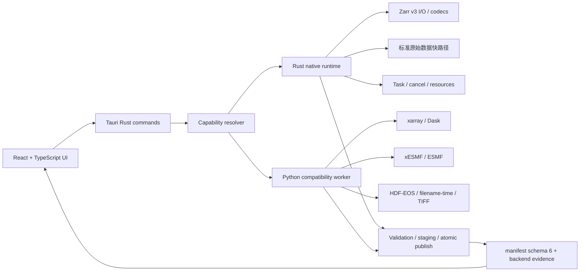

# v1.7.2 Native-first 开发方案

> 状态：开发中
>
> 目标版本：`1.7.2`
>
> 开发分支：`refactor/v1.7.2-native-first`
>
> 开发基线：`a8e231f`（`refactor/v1.7.1-tauri`）
>
> 更新日期：2026-08-13
## 当前实施状态

### P0 已完成（2026-08-13）

- [x] 创建 `refactor/v1.7.2-native-first` 开发分支。
- [x] 所有版本 manifest 同步到 `1.7.2`，IPC protocol 仍为 `1`。
- [x] 新增 `contracts/capability-v1.schema.json` 和 capability golden fixture。
- [x] Rust `BackendCapability` 增加 `OperationCapability` 明细，支持 operation、限制和不可用原因。
- [x] PyO3 `capability_json()` 自动返回新的 capability matrix。
- [x] Python `_backend.py` 解析 matrix，并兼容没有明细字段的旧 native payload。
- [x] TypeScript API 增加 `OperationCapability`、`BackendCapability` 和 `WorkerCapabilities` 类型。
- [x] Python worker capability 事件返回 native capability 明细。
- [x] 增加 schema、fixture、Rust model、Python native smoke 测试。
- [x] 默认 backend 仍保持 Python，未删除任何 fallback 或 PySide6 路径。

### 首批验证结果

- `pixi run version-check`：通过，所有 manifest 为 `1.7.2`。
- capability contract/native 测试：`18 passed`。
- 完整 Python 回归：`192 passed`、`1 warning`、`29 subtests passed`。
- 跨 backend native smoke：`14 passed`。
- Rust capability model：`1 passed`；Rust workspace clippy：通过。
- TypeScript typecheck 和 Vite production build：通过。
- capability fixture、JSON 配置和 `git diff --check`：通过。

P1 Tauri Rust task runtime 尚未开始；当前首批只建立 capability 地基，不提前切换
`backend=auto` 默认行为。

## 1. 版本目标

v1.7.2 的目标不是机械地删除所有 Python，而是将产品默认执行路径从

```text
React/TypeScript → Tauri → Python worker → Python services
```

迁移为：

```text
React/TypeScript → Tauri Rust → Rust native runtime
                                      │
                                      └── capability 不足时 → Python fallback worker
```

Rust 负责标准、稳定、可以建立交叉验证的主路径；Python 保留复杂科学数据兼容能力和
尚未达到正确性/性能决策门的 fallback。任何 fallback 都必须被 capability、manifest 和
事件明确记录，不能把 Python 执行伪装成 Rust 成功。

## 2. 当前基线

### 2.1 当前产品边界

当前版本已经支持：

- NetCDF/HDF/TIFF 到 Zarr v3 转换；
- 完整时间维度和文件名时间模式；
- HDF-EOS 网格元数据恢复；
- 范围裁剪、变量筛选、变量重命名、fill/scale 处理；
- Zarr v3 重采样、重分块和无损重压缩；
- Pipeline 计划、manifest schema 6、`events.jsonl`、检查点恢复和原子发布；
- PySide6 GUI、Python CLI 和 Tauri + React 桌面壳。

当前 Rust 已经可以通过 `fast_nc_zarr._native` 完成有限的 Zarr v3 inspection、chunk
读写和单变量 `float32` 重分块/重压缩。当前 Tauri 任务仍主要通过 Python JSONL worker
执行，React pipeline 请求也仍固定使用 Python backend。

### 2.2 Python 代码的保留边界

以下 Python 能力在 v1.7.2 中必须继续存在，直到对应的 Rust 实现通过真实数据回归：

| Python 能力 | 主要路径 | v1.7.2 策略 |
|---|---|---|
| 原始 NetCDF/HDF/TIFF 兼容读取 | `inspection.py`、`filename_mode.py` | 标准格式逐步 native；复杂格式 fallback |
| 文件名 DOY/YMD 时间轴 | `filename_mode.py`、`time_mapping.py` | 保留 Python fallback |
| HDF-EOS `StructMetadata.0` | `filename_mode.py` | 保留 Python fallback |
| xarray/Dask 转换语义 | `engine.py`、`writer.py` | 保留 reference/fallback |
| xESMF/ESMF 重采样 | `resampling/engine.py` | conservative/patch 等继续 Python |
| Pipeline manifest/recovery 兼容 | `pipeline/` | Rust 逐步成为 canonical，Python 继续兼容 |
| CF 属性、fill/scale 和科学结果校验 | `metadata.py`、`validation.py` | Rust 实现前保留 Python oracle |
| Python CLI 和 worker | `cli.py`、`application/desktop_worker/` | 兼容入口，不再作为 native-first 默认路径 |
| PySide6 GUI | `gui/` | Tauri UI parity 后降为 legacy，不立即删除 |

不得因为移除 PySide6 或 Python worker 就同时删除上述数据处理能力。

## 3. 目标架构



### 3.1 TypeScript 职责

- 桌面页面、表单和用户设置；
- 路径选择、收藏和最近目录；
- task 状态、进度、资源指标和日志展示；
- capability 和 fallback 状态展示；
- 不实现科学数值、planner、Zarr codec 或资源预算。

### 3.2 Tauri/Rust 职责

- typed command/request/response；
- task manager、取消、事件和资源快照；
- capability resolution；
- Pipeline plan、manifest 和恢复协议的 canonical 实现；
- Zarr v3 inspection、chunk I/O、codec、重分块和发布；
- 标准原始数据转换快路径；
- 基础规则网格重采样；
- Python fallback 的启动、状态和错误归一化。

### 3.3 Python 职责

- 复杂格式和复杂元数据兼容；
- xarray/Dask 科学数据模型；
- xESMF/ESMF 重采样；
- 非标准时间和 HDF-EOS；
- 尚未达到 capability 决策门的 fallback；
- 现有 Python CLI、API 和结果校验 reference。

## 4. 版本不变量

以下语义在 v1.7.2 全程保持不变：

- IPC `protocol_version` 继续为 `1`；
- Zarr v3 输出协议不变；
- `time/lat/lon` canonical 维度语义不变；
- pipeline manifest schema 6 在没有兼容性需要时不升级；
- 物理 chunk ownership 不重叠；
- CPU、内存、文件描述符和临时空间预算仍是硬边界；
- staging 校验成功前不得发布最终输出；
- 取消、异常、无权限和校验失败不得产生伪成功产品；
- `backend=python` 始终可用；
- `backend=rust` 能力不足时明确失败；
- `backend=auto` 才允许可解释地 fallback。

## 5. Capability 合同

### 5.1 设计

现有 `BackendCapability` 保留 `operations` 字段以兼容 v1.7.1；v1.7.2 增加
`capabilities` 明细数组：

```json
{
  "backend": "rust",
  "protocol_version": 1,
  "crate_version": "1.7.2",
  "operations": ["probe", "zarr.inspect"],
  "capabilities": [
    {
      "operation": "zarr.inspect",
      "supported": true,
      "reason": null,
      "limitations": ["Zarr v3 directory store"]
    },
    {
      "operation": "raw.netcdf.convert",
      "supported": false,
      "reason": "native reader is not implemented in this phase",
      "limitations": ["use Python fallback"]
    }
  ]
}
```

规范文件：

```text
contracts/capability-v1.schema.json
```

约束：

- `operations` 只列出当前支持的 operation ID；
- `capabilities` 可同时列出支持和不支持的 operation；
- `reason` 在不支持时必须说明原因；
- `limitations` 必须是稳定、可显示的限制说明；
- Python、Rust 和 TypeScript 不得各自定义不同的 operation ID；
- capability 细节不改变 IPC protocol version 1。

### 5.2 当前 operation ID

首批保留并明确以下已有 native operation：

```text
probe
zarr.inspect
zarr.read_chunk_f32
zarr.read_region_f32
zarr.write_f32
zarr.rechunk_f32
zarr.rechunk_f32_codec
zarr.rechunk_f32_cancel
```

预留但当前不支持的 operation：

```text
raw.netcdf.inspect
raw.netcdf.convert
resample.nearest
resample.bilinear
pipeline.native
```

不支持的 operation 必须通过 Python fallback 或明确错误处理，不能静默假设支持。

## 6. 分阶段计划

### P0：契约、版本和原生 capability probe

目标：建立 v1.7.2 所有后续迁移共享的事实来源，不改变默认 Python 执行语义。

交付：

- 版本字段统一到 `1.7.2`；
- `capability-v1.schema.json`；
- Rust `OperationCapability` 和 capability matrix；
- PyO3 `capability_json()` 返回完整 capability；
- Python `_backend.py` 解析 capability 明细；
- Tauri/TypeScript capability 类型；
- capability schema、Rust model、Python probe 测试。

验收：

- Rust capability JSON 符合 schema；
- `operations` 与 `capabilities[supported=true]` 集合一致；
- capability 缺失时 Python 能以明确原因降级；
- 现有 Python fallback 不受影响；
- `pixi run version-check` 通过。

### P1：Tauri Rust task runtime

目标：让 Tauri 能在不启动 Python worker 的情况下管理 native task。

交付：

- typed `TaskRequest`、`TaskEvent`、`TaskSummary`；
- 每个任务独立 cancellation handle；
- Rust resource snapshot；
- native event emitter；
- Python worker 和 Rust task 使用同一 event envelope；
- worker failure、fallback reason 和 terminal event 归一化。

不做：

- 不在这一阶段重写所有科学算法；
- 不删除 Python worker；
- 不改变现有 manifest schema 6。

### P2：React/TypeScript 功能 parity

目标：Tauri UI 覆盖当前 PySide6 的主用户路径。

迁移页面：

1. 输入检查：输入类型、递归、engine、变量和维度映射；
2. 时间规则：完整 time、filename DOY/YMD、建议规则确认；
3. 结构结果：变量、维度、坐标、warnings、快照；
4. 处理流程：conversion、resampling、rechunk、recompress、codec 和资源设置；
5. 任务中心：进度、资源、日志、取消、manifest 和恢复；
6. 路径设置：收藏、最近目录、失效路径和迁移。

完成 parity 前，PySide6 继续保留为 legacy 实现。

### P3：Rust Zarr 能力扩大

顺序：

1. 多变量；
2. `float64`；
3. 基础整数 dtype；
4. coordinate/data variable 区分；
5. fill value、scale/offset 和 CF 属性；
6. codec-only 和等价布局复制；
7. 多阶段重分块；
8. 自动压缩候选和性能指标。

每一步都需要 Python ↔ Rust fixture 交叉验证。

### P4：标准 NetCDF native conversion

初始范围严格限制为：

- 标准 NetCDF；
- 标准 `time/lat/lon`；
- 三维数值变量；
- 明确 dtype、fill/scale；
- 一维规则经纬度；
- 输出 Zarr v3。

继续 Python fallback：

- HDF-EOS；
- 文件名时间；
- 非标准维度和复杂 CF；
- TIFF/GDAL；
- 非标准 calendar；
- 非数值变量；
- xarray 对齐/广播语义。

Rust reader 应使用 feature-gated 依赖，不能把 HDF5、GDAL 和 ESMF 一次性变成所有
平台的默认 ABI 依赖。

### P5：基础规则网格重采样

第一批只实现：

- `nearest_s2d`；
- `nearest_d2s`；
- `bilinear`；
- 一维规则经纬度；
- float32/float64；
- 明确的 NaN/fill 语义；
- 有界 tile/time block；
- 不外推。

以下继续使用 Python xESMF：

- conservative；
- conservative_normed；
- patch；
- 复杂缺测场景；
- ESMF weight cache。

### P6：Native-first 默认路径

满足正确性和性能决策门后：

```text
backend=auto
→ capability supported: Rust
→ capability unsupported: Python fallback
```

建议 v1.7.2 后期将 pipeline 默认 backend 从 `python` 改为 `auto`，但必须先完成真实
数据 A/B 和 fallback evidence。未满足决策门时，默认仍可保持 Python，避免发布回归。

### P7：Python 主路径退出和后续清理

可优先退出桌面主路径：

- PySide6 GUI；
- Python GUI worker；
- Python path picker；
- Python GUI 字体资源。

必须继续保留至后续版本：

- Python worker；
- `inspection.py`、`filename_mode.py`、`time_mapping.py`；
- Python xESMF；
- raw conversion fallback；
- Python validation oracle；
- Python pipeline recovery compatibility。

## 7. 首批开发工作（P0）

首批开发不直接重写数据算法，先建立迁移地基：

1. 创建 `refactor/v1.7.2-native-first` 分支；
2. 将版本 manifest 同步到 `1.7.2`；
3. 新增 capability schema；
4. 为 Rust capability 添加 typed operation details；
5. 保留 `operations` 兼容字段；
6. 让 PyO3 返回 capability matrix；
7. 让 Python 适配层解析 matrix 并保留旧 native 缺失兼容；
8. 暴露 TypeScript capability 类型；
9. 增加 schema、Rust model、Python probe 和 fixture 结构测试；
10. 不把 `backend=python` 默认值提前改为 `auto`。

首批完成的判定不是“Rust 代码增加”，而是：

- capability 成为跨语言的单一事实来源；
- unsupported operation 可解释；
- Python fallback 行为没有变化；
- 后续 Tauri task runtime 可以直接消费此合同。

## 8. 测试策略

### 8.1 当前回归基线

v1.7.2 不能降低 v1.7.1 已验证的基线：

```text
Python: 188 passed
subtests: 29 passed
native smoke: 12 passed
Rust core tests: passed
Rust clippy: passed
TypeScript typecheck: passed
Vite production build: passed
Linux Tauri deb build: passed
```

### 8.2 Capability 测试

必须覆盖：

- JSON schema 结构；
- protocol version；
- crate version；
- supported operations；
- unsupported operation 的 reason；
- limitations 数组；
- operations 与 supported matrix 一致；
- Python native extension 缺失；
- native response 缺字段或 JSON 无效；
- `auto` fallback；
- `rust` 明确失败；
- `python` 始终可选。

### 8.3 交叉 backend 测试

每个 native 数据 fixture 至少执行：

```text
Python 写入 → Rust 读取
Rust 写入 → Python zarr/xarray 读取
Python backend → Rust backend 结果比较
```

比较：

- shape、dtype、dimensions；
- time/lat/lon；
- attrs 和 fill value；
- chunks 和 codec metadata；
- NaN/缺测值；
- 代表性逐值结果；
- 输出目录结构；
- manifest/backend evidence。

不要求压缩后的物理字节完全相同，但要求解码值和 Zarr 语义一致。

## 9. 性能和发布决策门

### 9.1 正确性门

Rust operation 只有在以下条件全部满足后才能进入 `auto`：

- Python/Rust fixture 全部通过；
- cancel、failed、无权限、overwrite 和 validation failure 语义一致；
- staging 未校验前不发布；
- capability 不支持时 fallback 可解释；
- manifest schema 6 和 events 证据可重放。

### 9.2 性能门

固定源数据、chunks、codec、临时目录、输出文件系统和 worker ceiling，至少重复五次，
使用中位数比较：

- wall time；
- logical/durable throughput；
- peak RSS；
- CPU 使用率；
- 物理读写量；
- 压缩率；
- Python 调度耗时；
- fallback 次数和原因。

首次将 Rust operation 设为默认候选前：

- 不得比 Python 中位数慢超过 10%；
- 至少一个真实 workload 必须有可重复收益；
- 不能把一次 HDD cache 命中当成性能结论；
- 不能以扩大内存或线程超卖换取表面吞吐。

### 9.3 发布门

- Linux、Windows、macOS runner 可重复构建；
- native Rust 构建不依赖本机绝对路径；
- Python fallback sidecar 仍可构建；
- native-only 桌面路径不依赖 PySide6；
- fallback 依赖和错误在 UI 中可见；
- release 包记录版本、commit、平台、toolchain 和 SHA-256。

## 10. 风险和回滚

主要风险：

1. `zarrs` 与 Python zarr v3 的 metadata/codec 差异；
2. NetCDF/HDF5/GDAL native ABI 和跨平台发行；
3. Python/Rust buffer 转换造成隐式复制；
4. HDF-EOS、CF、fill/scale 语义缺失；
5. cancellation 与 task registry 竞争条件；
6. xESMF 仍依赖 Python，完整产品暂时不会是纯 Rust；
7. Tauri UI parity 不完整导致用户流程回退；
8. capability 过早宣称支持，造成 silent fallback 或数据错误。

回滚原则：

- 每个 operation 通过显式 capability 才能启用；
- `backend=python` 永远保留；
- `backend=rust` 不支持时明确失败；
- `backend=auto` fallback 必须写明原因；
- 任意数值或 metadata 回归时回退 Python；
- Python 实现至少保留一个完整版本周期，直到真实数据回归完成；
- 不删除 PySide6/worker/复杂输入 fallback，除非对应迁移和发布验收已完成。

## 11. 首批之后的建议提交顺序

```text
1. docs: add v1.7.2 native-first plan
2. chore: synchronize v1.7.2 version metadata
3. feat: define capability-v1 contract
4. feat: expose typed native capability matrix
5. test: verify capability contract and fallback behavior
6. feat: add Rust task runtime
7. feat: migrate TypeScript inspection and task UI
8. feat: expand native Zarr support
9. feat: add standard NetCDF native path
10. feat: add basic native resampling
```

每个提交都应保持可构建、可回滚，并独立记录验证结果。不得将删除 Python fallback、修改
默认 backend 和大规模 GUI 改写混在 capability 地基提交中。
