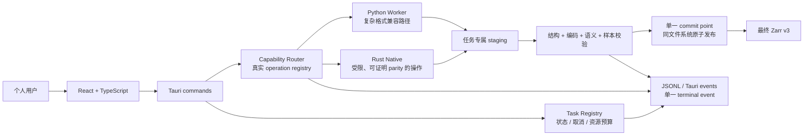
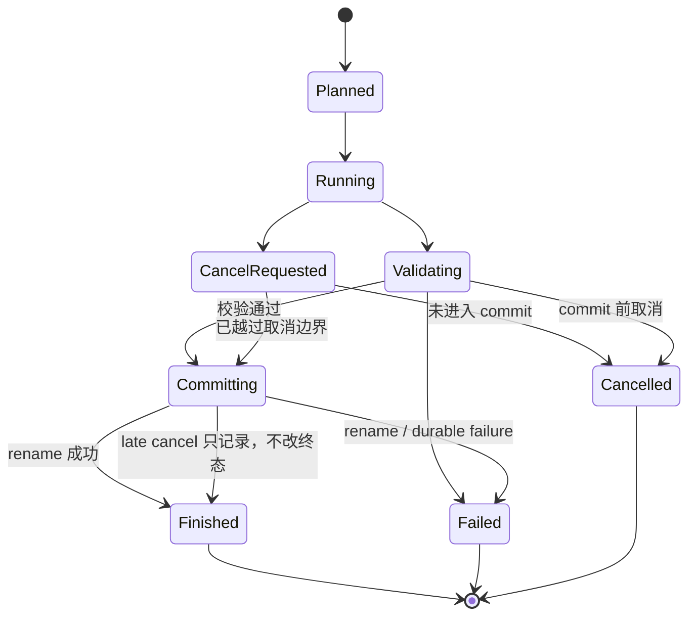

# Fast NC Zarr v1.7.4 开发与完整优化方案

- **目标版本**：`v1.7.4`
- **基线版本**：`v1.7.3`
- **方案类型**：数据正确性、事务发布、任务可靠性、资源约束、安全和发布工程的加固版本
- **目标平台**：Linux `x86_64-unknown-linux-gnu` 为阻塞发布平台；Python 3.13、Rust workspace、Tauri 2 + React 19
- **相关基线**：[`comprehensive-code-audit-2026-08-15.md`](comprehensive-code-audit-2026-08-15.md)
- **当前状态**：实施中；代码已切换至 `1.7.4`，尚未完成的 release gate 仍以本文档清单为准

## 1. 版本定位

`v1.7.4` 不扩张格式范围，不追求一次性完成所有 Rust native parity，而是把 v1.7.3 的主要风险收敛为可验证的产品契约：

> **先保证结果正确、输出可回滚、任务状态可信，再优化 native 性能和用户体验。**

本版本的成功标准不是“增加更多操作”，而是以下行为对每个输入、失败和取消场景都成立：

1. 用户不会得到被错误标记为成功的半成品 Zarr。
2. `_FillValue`、`missing_value`、`scale_factor`、`add_offset`、CRS、calendar 和坐标边界语义不会在 backend 切换时静默变化。
3. `auto` 路由只选择有真实 handler 和正确性证据的能力；`rust` 不支持时明确失败；兼容路径 fallback 有原因记录。
4. 取消、发布和任务终态具有明确的提交边界，不再出现“已发布但 cancelled”或“输出已删除但 finished”。
5. 任务、IPC、数组和临时空间受到统一资源预算约束，个人用户的大数据任务不会无限制地拖垮桌面进程。
6. 发布包能在干净环境启动、找到受信任的 worker，并执行至少一个真实 Tauri/worker IPC 流程。

## 2. 当前基线与主要问题

v1.7.3 已有完整的 Python 处理链、Rust Zarr 核心、PyO3 扩展、Tauri 桌面端、JSONL worker、任务恢复和 staging 发布基础；但当前实现存在以下结构性缺口：

| 领域 | v1.7.3 基线 | v1.7.4 处理方向 |
|---|---|---|
| Native NetCDF | 直接写最终目录；dtype、fill、scale/offset 语义不完整 | 统一数据语义、流式读取、staging + validation + commit |
| Native resample | Python list/JSON 全量往返；nearest 越界返回边缘值 | chunk/typed-buffer API、越界 NaN、encoding parity |
| Capability | model capability 与 Tauri dispatcher 各维护一套清单 | 单一 operation registry，自动生成 capability 和测试 |
| Cancellation | marker 与任务执行脱节，终态可能与输出不一致 | task state machine + commit point + task registry 路由 |
| Worker IPC | 同步 dispatch；检查阶段 stdout 可能污染 JSONL；stderr 丢弃 | stdout 纯 JSONL、可路由取消、有界 payload、保留诊断 |
| 输入语义 | TIFF CRS、非标准 calendar、完整 raw validation 覆盖不足 | 明确 capability boundary、签名校验、兼容路径和 fixture |
| 安全 | sidecar 信任环境变量/开发路径；恢复 manifest 信任度过高 | release fail-closed、路径约束、manifest 重验证、CSP |
| 发布 | wheel 依赖未声明；desktop runtime 未在 CI 启动；contract 版本漂移 | 干净环境安装、安装包 smoke、签名/digest、版本一致性 |

详细证据以 v1.7.3 审查报告为准，尤其是 C-01、H-01～H-17、M-01～M-17 和 L-01～L-02。

## 3. v1.7.4 目标架构

### 3.1 目标数据流



### 3.2 目标任务状态机



### 3.3 版本契约决策

| 契约 | v1.7.4 决策 |
|---|---|
| 软件版本 | 全部 release/runtime/build manifest 统一为 `1.7.4` |
| Tauri/Python worker protocol | 继续使用 protocol version `1`；不改变必需 envelope 字段 |
| Capability schema | 继续使用 `capability-v1`，但操作清单改为 registry 生成并更新 fixture |
| Pipeline manifest | 固定为 schema version `7`；补充明确的 v6 → v7 migration；代码、文档和 recovery 必须一致 |
| Event terminal semantics | 保持 `finished`/`failed`/`cancelled` 三类 terminal event，增加可选 `commit_state`、`cancel_effective`、`fallback_reason` 字段 |
| JSON compatibility | 保持未知 payload 字段向前兼容；新增字段默认可缺省；禁止把 native-only command 当作 Python worker command |

## 4. 不可破坏的产品不变量

以下不变量是 v1.7.4 的 release blocker。任一不变量无法由自动化测试证明，版本不得标记为稳定发布版。

### I-01：显式数据语义

每个 output variable 必须记录：

- source dtype 和 output dtype；
- `_FillValue`、`missing_value`；
- `scale_factor`、`add_offset`；
- `mask_and_scale`/decode policy；
- calendar、units、CRS/transform（适用时）；
- backend、fallback reason 和实际执行策略。

### I-02：最终路径的事务性

任何 output-producing operation 在 validation 和 commit 之前不得创建或修改用户最终目录。staging 必须：

- 位于最终目标同一父目录，避免跨文件系统 rename；
- 使用随机、任务绑定的名称；
- 拒绝 symlink、source/target identity、source/target nesting 和 alias；
- 失败、取消和 panic 路径均清理；
- 只有一个 commit point 将其原子发布。

### I-03：终态与文件系统一致

- 发布前取消只能得到 `cancelled`，且目标保持原状；
- commit 成功后收到取消请求，不得把已成功发布的任务改为 `cancelled`；
- `finished` 必须对应可检查的最终输出；
- 每个 task 只能有一个 terminal event；
- terminal registry 状态持久化成功后才能对外发 terminal event。

### I-04：能力声明真实可执行

能力报告中的每个 operation 必须有：真实 handler、输入约束、backend、取消支持、发布保证、测试证据和 fallback 说明。未满足这些条件的操作只能报告为 unsupported。

### I-05：源数据稳定

执行期间源文件或源 Zarr 被修改时，任务必须检测并失败，不得把不同版本的 metadata、auxiliary files 和 data chunks 混入一个输出。

### I-06：资源有界

任务并发、worker 数量、IPC 行长度、JSON 深度、数组 cardinality、预计输出大小、临时空间和历史记录都必须有硬上限；超限在大分配和反序列化前拒绝。

### I-07：协议通道干净

Python worker stdout 只能输出 JSONL；人类诊断只能进入 stderr 或结构化 `log` event。Rust 必须有界读取行并校验 request ID、sequence、event type 和 terminal uniqueness。

### I-08：受信任执行边界

release 版本只执行受信任安装目录中的 sidecar；不信任环境变量覆盖、任意 Python、可写开发 checkout 或未经校验的 recovery manifest。

## 5. 实施工作包

### Phase 0：版本、契约和基线冻结

#### V174-01 版本切换与一致性检查

**目标**：将 v1.7.4 变成可验证的唯一版本，而不是只修改显示字符串。

**实施内容**：

- 更新 `VERSION`、`pixi.toml`、`pyproject.toml`、workspace `Cargo.toml`、Rust crate manifests；
- 更新 `apps/desktop/package.json`、lockfile、`tauri.conf.json`、Python package version 和 Rust backend info；
- 扩展 `scripts/check_version_consistency.py`，覆盖 contracts README、capability fixture、versioned docs 和 package metadata；
- 清理或替换所有 v1.7.2/v1.7.3 的 release 文案；
- 保持 protocol version 1，不把软件版本和协议版本混为一谈。

**验收**：

- version check 能发现任一残留旧版本；
- `1.7.4` 在 CLI、desktop backend info、wheel metadata、Tauri package 和 capability report 中一致；
- protocol compatibility test 仍通过。

#### V174-02 Contract v1 和 Manifest v7 固化

**目标**：修复当前 contract 文档、fixture、代码 schema 版本漂移。

**实施内容**：

- 将 `contracts/README.md` 和 fixture 的 release 文案统一为 v1.7.4；
- 保持 `capability-v1.schema.json`，新增/明确可选字段：`backend`、`fallback_reason`、`supports_cancel`、`commit_state`、`resource_budget`；
- 正式定义 manifest schema 7，提供 v6 → v7 显式迁移，不允许 recovery 静默解释旧结构；
- 从 Python worker command allowlist 中移除 native-only `native_task`，或明确拆分 Tauri native command 与 worker command 的 schema；推荐前者；
- 使用 JSON Schema validator 校验 request、event、error、capability fixture 的实例，而不是只检查 `$schema` 字符串。

**验收**：

- schema fixture 能拒绝缺必需字段、非法 enum、过大/越界字段；
- v6 manifest 只能通过显式 migration 进入 v7；
- `native_task` 不会再出现“协议接受但 Python dispatch 未实现”的状态。

### Phase 1：数据正确性与事务发布

#### V174-03 统一 Data Semantics / Encoding Policy

**目标**：让 Python、Rust native 和 Zarr output 对数据编码采用同一政策。

**决策**：v1.7.4 默认使用 **`preserve_raw`**，保持当前 `mask_and_scale=False` 的源读取习惯，避免未经用户同意改变数值；需要物理值时使用显式 `decode_physical`。

**策略定义**：

- `preserve_raw`：写入原始存储 dtype/value，保留 `_FillValue`、`missing_value`、`scale_factor`、`add_offset`、units 和 source provenance；
- `decode_physical`：对非缺测值应用 `physical = raw * scale_factor + add_offset`，缺测值映射为明确 output fill；必要时提升 dtype；移除已应用的 scale/offset，并写入 `source_*` provenance；
- 禁止只应用 scale 而忽略 add_offset；禁止 attrs 看似保留但 Zarr array fill 不一致；
- 扩展 `VariableTransform`、CLI、pipeline model 和 manifest，增加 `add_offset` 与 `encoding_policy`；
- native NetCDF 暂不启用整数 conversion，除非 parity gate 完成；整数输入在 `auto` 路由到 Python，`rust` 明确返回 unsupported。

**主要文件**：

- `src/fast_nc_zarr/models.py`
- `src/fast_nc_zarr/inspection.py`
- `src/fast_nc_zarr/writer.py`
- `src/fast_nc_zarr/validation.py`
- `src/fast_nc_zarr/engine.py`
- `rust/crates/fast-nc-zarr-model/src/`
- `rust/crates/fast-nc-zarr-zarr/src/netcdf_native.rs`

**验收**：

- packed float/integer、非 NaN fill、NaN fill、scale + offset 在 Python/native/round-trip 中逐值一致；
- `inspect`、plan、manifest、output metadata 对 policy 一致；
- 未请求 decode 时，原始值不被静默改变；
- output 的实际 Zarr fill 与 attrs/encoding 一致。

#### V174-04 统一 StagedOutput / Publish Transaction

**目标**：所有 output-producing path 使用相同的发布不变量。

**实施内容**：

- Rust 新增最小 `StagedOutput`/`PublishGuard` helper，负责 sibling staging、source/target containment、symlink/alias 检查、cleanup、commit；
- `convert_netcdf_to_zarr` 改为 staging 写入，失败不触碰最终路径；
- native write/resample/rechunk、多变量和 Python publication 对齐 commit 语义；
- Python `publish_staging` 在 target validation、backup 和 cleanup 处加入 inode/identity 保护，避免同用户 TOCTOU 删除非预期目录；
- snapshot 使用随机临时文件 + exclusive create + no-follow，写入并 fsync 后再替换；
- 跨设备 staging/target 默认拒绝，并在错误中给出迁移临时目录建议。

**验收**：

- 注入 metadata、chunk、权限、磁盘空间、rename、fsync 和 validation failure，最终目标保持旧内容或不存在；
- 取消/崩溃后只有任务临时目录可见；
- symlink、source/target 相同、nested target、`..` alias 全部被拒绝；
- 多变量、单变量、NetCDF、resample、pipeline 五条路径共享相同测试矩阵。

#### V174-05 源快照与坐标/CRS/calendar 签名

**目标**：防止源数据在任务期间变化，防止空间/时间元数据不一致。

**实施内容**：

- 对每个源文件记录 size、mtime、inode（可用时）、设备和内容/轴 hash；
- 对 Zarr 记录 group metadata、array metadata、coordinate hash、codec/fill signature；
- filename TIFF signature 加入规范化 CRS/WKT、affine transform、axis direction、nodata、dtype、band policy；
- 非标准 calendar 进入 capability boundary：支持则保留 calendar-aware 值，不支持则进入 Python compatibility 或 deterministic unsupported；禁止强制 Gregorian；
- 发布前重新验证 source fingerprint。

**验收**：

- 修改源文件、替换 symlink、改变 CRS、改变 calendar 后任务失败且不发布；
- 相同数字轴但不同 CRS 的 TIFF 序列被拒绝；
- 标准和非标准 calendar 的 output/错误行为有明确 fixture。

#### V174-06 Native NetCDF 安全和流式读取

**目标**：在不牺牲正确性的前提下降低 native 内存峰值。

**实施内容**：

- inspection 阶段严格检查 coordinate dtype、data dtype、维度、规则性和 calendar；外部 dtype 不得进入 `unreachable!()`；
- `get_values(..)` 改为按 hyperslab/chunk 读取；每个变量只保留有限 working set；
- 将 EffectiveResourceBudget 传入 native conversion，在读取前估算并拒绝超限；
- native integer conversion 保持 disabled，直到完整 parity 测试通过；capability 与 inspect 共同使用同一 subset predicate；
- native task 入口增加 panic boundary，将 panic 转为 `failed`、清理 staging、更新 registry。

**验收**：

- 非数值坐标、unsupported dtype、超限输入均返回结构化错误；
- 大变量压力测试峰值受 budget 限制；
- 失败后的最终目录不存在或保持原目标；
- `auto` 对 integer NetCDF 选择 Python 并记录 fallback reason。

#### V174-07 Native resample 正确性与数据通道重构

**目标**：修复越界错误并消除 Python list/JSON 的全量数据复制。

**实施内容**：

- nearest 在两个轴任一越界时返回 NaN，支持 ascending/descending axes；
- native output 复制/规范化 fill、scale/offset、attrs、coordinate metadata 和 codec，并将这些字段加入 validation；
- 优先实现按 owner chunk/time block 的 API，使用 NumPy buffer protocol/typed buffer；Rust 只接收当前 chunk，不接收完整 dataset；
- 若 typed buffer binding 在 v1.7.4 中不稳定，使用 task-owned binary/memmap 文件传递 chunk，禁止 JSON 数组承载大数据；
- 保持 native 不支持的复杂 xESMF 方法继续走 Python compatibility。

**验收**：

- OOB nearest、descending latitude、NaN/fill 和边缘像元有 golden tests；
- native/Python 在同一输入上 output values、fill、attrs、chunks、codec 等价；
- benchmark 不再出现 source + nested list + JSON + Rust clone 同时保留；
- 超过 memory/output budget 时 deterministic `resource_budget_exceeded`。

### Phase 2：任务、IPC 和安全边界

#### V174-08 Task Registry 与 Cancellation Commit State

**目标**：让取消成为真实的任务控制，而不是事后 marker 判断。

**实施内容**：

- Rust/Python 共用 task state 字段：`planned`、`running`、`cancel_requested`、`validating`、`committing`、`finished`、`failed`、`cancelled`；
- 建立 `task_id -> cancellation handle` registry；Python worker 长任务使用可接收取消的 worker thread/process；
- cancellation file 只作为 fallback signal，路径由 task UUID 重算，不从持久化 JSON 直接信任任意路径；
- commit 前后的取消语义按 I-03 执行；终端事件 payload 记录 `commit_state`、`cancel_effective`；
- spawn、persist、event、cleanup 任一失败都产生可恢复 terminal failure，不吞掉关键错误。

**验收**：

- cancellation 在 inspection、conversion、resample、rechunk、publish 各阶段都有测试；
- cancel race 重复运行仍只有一个 terminal event；
- 已 commit 后取消不改变 finished；
- 重启会正确恢复 active task，不留下永久 Running。

#### V174-09 Worker JSONL、stderr 和 IPC Quota

**目标**：保护桌面协议边界，避免 stdout 污染和资源放大。

**建议默认配额**：

| 项目 | 默认策略 |
|---|---|
| 单条 JSONL request/event | 1 MiB；超过则在反序列化前拒绝 |
| JSON nesting depth | 32 |
| native control payload | 4 MiB；大数组改为路径/typed buffer |
| active desktop tasks | 默认 2 个 CPU-bound 任务，超限排队或返回 `resource_budget_exceeded` |
| task history | 只保留有界数量和有界总字节，可配置 |
| stderr | 每个 task 有界 ring buffer，防止诊断本身耗尽内存 |

**实施内容**：

- worker 所有 dispatch 包裹统一 stdout/stderr sink；
- Rust 读取 worker stdout 时限制 line length，stderr 开独立 reader；
- request、array shape、chunks、worker count、output estimate 做 schema + quota 校验；
- 从 `sequences`、`terminal_tasks` 删除已完成请求的长期 bookkeeping；
- UI 显示“排队/资源限制/取消请求中”，不把排队误显示为运行。

**验收**：

- inspection/planning 的任何 print 都不会进入 stdout；
- malformed JSON、超大 JSON、深嵌套 JSON、超长数组均快速失败；
- worker import/start failure 能在 desktop error 中看到最后几行受控诊断；
- 反复提交任务不会造成线程、map、历史和临时目录无限增长。

#### V174-10 桌面安全和不可信输入边界

**实施内容**：

- release 只从受信任安装资源目录加载 sidecar；忽略 `FAST_NC_ZARR_WORKER`、`FAST_NC_ZARR_PROJECT_ROOT`、`PYTHON` override，开发版单独开关；
- 校验 regular file、拒绝 symlink，并在构建时记录/运行时校验 sidecar digest；
- recovery manifest 视为不可信导入，重新确认 output、source、overwrite、backend 和 resolved containment；
- `array_path` 在每个 open/read/write 入口统一调用 strict path validator；
- production 设置 restrictive CSP，继续禁止远程 origin；
- task/manifest/error/localStorage 默认使用脱敏或 opaque path label；详细路径只写受保护 diagnostic。

**验收**：

- 被篡改的环境变量不会改变 release worker；
- sidecar 缺失、digest 不一致、symlink sidecar 都 fail closed；
- 恢复恶意 manifest 不得写入用户确认范围之外；
- path traversal、absolute path、prefix、symlink alias 有自动化测试。

### Phase 3：性能、依赖与产品体验

#### V174-11 资源预算和性能优化

**目标**：把性能优化建立在可解释的预算和指标上。

**实施内容**：

- 扩展 `EffectiveResourceBudget` 到 Python、Rust、worker、resample 和 package runtime；
- 统一记录 planned/actual peak RSS、CPU、临时空间、logical bytes、physical bytes、写放大、chunk owner 和 fallback；
- conversion 使用 hyperslab；resample 使用 chunk owner；避免完整时间中转 store；
- compression auto 继续使用 begin/middle/end temporal strata，记录实际 sample locations；
- 未知 codec/shuffle 值返回 InvalidRequest，不再静默 NoShuffle；
- 目标是让“速度、balanced、compact”选择有可审计的 benchmark 证据，而不是只看首个样本。

**验收**：

- 每次自动调优都有候选、预算、样本位置、选择原因和结果指标；
- 大数据压力测试超预算时可控失败，不以 OOM 作为控制流；
- invalid codec/shuffle 有明确错误；
- 重复运行在相同 fixture 上计划选择稳定或解释差异。

#### V174-12 Python packaging 和 sidecar 构建

**实施内容**：

- 在 `pyproject.toml` 声明核心依赖；将 HDF/TIFF、xESMF/ESMF、开发测试依赖拆成 optional extras；
- 增加 clean venv/wheel install/import/CLI smoke；
- sidecar 脚本在发布模式缺少 PyInstaller、输出缺失、artifact stale 或 hash 不一致时 fail；
- `release-candidate` 使用与 CI 相同的 target-qualified bundle root；
- Linux deb/rpm 生成签名或至少生成可验证的 sidecar/package digest，并上传 provenance metadata。

**验收**：

- 干净 Python 环境可以安装并执行 `inspect`/`--help`；
- sidecar 不存在时不会沿用旧 binary；
- target triple、profile、package count 和 artifact hash 校验一致；
- 安装包验证 bundled worker、font、icon、frontend assets。

#### V174-13 前端路由、可解释性与隐私

**实施内容**：

- capability matrix 展示 operation、backend、限制、fallback reason、是否支持取消和 output commit guarantee；
- 用户看到“当前执行路径”和“为何未使用 native”，而不是模糊的 available/unavailable；
- 任务中心区分 queued/running/cancel requested/committing/finished/failed/cancelled；
- 发布失败显示目标是否保持不变、是否可以安全重试；
- 近期路径使用 label + basename，绝对路径通过显式展开或诊断入口查看；
- 资源超限、输入不支持、语义校验失败、权限失败和发布失败使用不同错误文案。

**验收**：

- UI 不展示 capability registry 中没有真实 handler 的操作；
- fallback、commit、cancel race 的 manifest/events 与 UI 一致；
- localStorage/task history 默认不保存不必要的完整绝对路径。

### Phase 4：测试、CI 和发布验证

#### V174-14 测试矩阵

新增或扩展以下测试类别：

| 类别 | 计划位置 | 必测场景 |
|---|---|---|
| 数据语义 | `tests/test_data_semantics.py`、Rust native tests | raw/decoded、fill、missing、scale、offset、dtype promotion |
| Native NetCDF | `tests/test_native_netcdf_edge_cases.py` | integer capability、非数值坐标、失败清理、超预算、源修改 |
| Resample parity | `tests/test_resample_backend_parity.py` | nearest OOB、descending axis、fill/encoding、Python/native 数值等价 |
| TIFF/HDF | `tests/test_tiff_crs.py`、`tests/test_hdf_eos.py` | CRS mismatch、affine、nodata、band、StructMetadata、group fallback |
| Calendar | `tests/test_calendar_policy.py` | standard、360_day、365_day、all_leap、明确 unsupported |
| Publication faults | `tests/test_publication_faults.py`、Rust tests | write/rename/fsync/permission/disk/validation/cancel failure |
| Worker protocol | `tests/test_worker_protocol.py` | stdout purity、stderr、quota、cancel routing、terminal uniqueness |
| Security | `tests/test_path_trust_boundaries.py` | traversal、symlink、nested target、manifest output containment、sidecar selection |
| Property/fuzz | Rust proptest 或 Python property tests | path components、JSON envelopes、axis direction、shape/chunk invariants |
| Package smoke | `.github/workflows/` | clean wheel install、sidecar、installed desktop、real IPC |

**测试原则**：每个测试必须防止一个具体回归；不能只断言源码字符串或默认值。所有 P0 问题必须有“失败前目标状态”和“terminal event 状态”断言。

#### V174-15 CI 目标流水线

CI 依赖关系建议固定为：

1. `version-check`：runtime/build/contracts/docs 全覆盖；
2. Rust fmt、clippy、workspace tests、desktop crate tests；
3. Python unit/integration tests；
4. PyO3 native build + native smoke + backend parity；
5. frontend typecheck/build；
6. sidecar clean build + artifact hash check；
7. Tauri Linux package build；
8. headless installed-package launch；
9. worker IPC inspection/task/cancel smoke；
10. package metadata、bundled assets、digest/signature/provenance；
11. 上传失败日志和最终 packages。

Linux release gate 必须至少验证：

- X11 launch；
- Wayland 或明确 fallback 行为；
- bundled worker 启动；
- 中文字体、图标和前端资源加载；
- `inspect_source`、`preview_pipeline`、`start_pipeline`、`cancel_task` 至少各一条真实 command/event 路径。

## 6. 依赖关系与执行顺序

```text
V174-01 版本/一致性
   ↓
V174-02 Contract v1 + Manifest v7
   ↓
V174-03 数据语义 ───────┐
V174-04 发布事务 ───────┼──> V174-06 Native NetCDF
V174-05 源快照 ────────┘       └──> V174-07 Native resample
                                      ↓
                              V174-08 任务取消/commit
                                      ↓
                              V174-09 IPC quota
                                      ↓
                              V174-10 桌面安全
                                      ↓
                       V174-11 性能 ─ V174-12 打包
                                      ↓
                         V174-13 UI ─ V174-14/15 测试与 CI
```

### 推荐的合并顺序

1. 先合并契约、状态机、数据语义和发布 helper 的模型/测试，不立即扩大 native capability；
2. 再实现 Rust/Python 两侧的 P0 修复，所有新路径默认走 Python compatibility 直到 parity 测试通过；
3. 再接入 typed/chunk native resample 和 NetCDF 流式读取；
4. 最后切换 capability、前端展示、sidecar trust、package metadata 和 CI gate；
5. 版本号最后统一切换为 1.7.4，并执行完整 release rehearsal。

## 7. `auto`、`rust`、`python` 路由规范

### `auto`

- 优先选择满足 capability、数据语义、resource budget、staging 和测试证据的 native operation；
- 不满足任一条件时选择 Python compatibility；
- manifest/event 必须写入 `requested_backend=auto`、`selected_backend` 和稳定 `fallback_reason`；
- fallback 不是失败，但必须可解释。

### `rust`

- 只允许真实 registry 中有 handler 且通过 parity gate 的 operation；
- 不支持 integer NetCDF conversion、复杂 HDF/TIFF、非标准 calendar、复杂 xESMF 时明确返回 `backend_unavailable`；
- 不得偷偷回退 Python。

### `python`

- 作为完整兼容路径；
- 同样必须遵守 staging、validation、source snapshot、resource budget 和 terminal state 契约；
- Python 不是“绕过安全边界”的后门。

## 8. 发布前 Definition of Done

### 功能与正确性

- [ ] C-01、H-01、H-02、H-03、H-08、H-09 已修复并有回归测试；
- [ ] Python/native 对 fill、scale、offset、CRS、calendar 和 OOB 行为完成 parity 证明；
- [ ] 所有 output-producing path 在 commit 前不修改最终目录；
- [ ] source mutation、permission、disk full、rename failure、cancel race 不产生伪成功；
- [ ] capability matrix 与 dispatcher 自动化一致。

### 可靠性与安全

- [ ] worker stdout 纯 JSONL，stderr 有界可见；
- [ ] task、IPC、数组、临时空间和历史都有硬上限；
- [ ] release sidecar fail-closed 且有 digest/signature/provenance；
- [ ] recovery manifest、array path、snapshot temp file 和 publication race 有测试；
- [ ] 绝对路径默认脱敏。

### 发布与运维

- [ ] wheel 可在 clean environment 安装和执行；
- [ ] desktop Rust tests 纳入 CI；
- [ ] 安装包能启动并完成真实 worker IPC；
- [ ] deb/rpm、worker、font、icon、frontend assets 完整；
- [ ] v1.7.4 版本检查、contract fixture、manifest migration、docs links 全部通过；
- [ ] 发布日志包含 backend selection、fallback、resource budget 和已知限制。

## 9. 明确不纳入 v1.7.4 的范围

为避免继续扩大正确性风险，以下事项保留到后续版本：

- 云对象存储、远程任务和多用户服务端；
- Windows/macOS 阻塞发布支持；
- 非规则/曲线网格和投影坐标自动重投影；
- 时间聚合、日内时间轴和复杂 calendar 的完整 native parity；
- 全量 HDF/HDF-EOS native conversion；
- 分类变量专用重采样算法自动选择；
- 在没有 parity fixture 前将整数 NetCDF conversion 宣布为 native supported；
- 以“增加 worker 数量”替代资源预算和 I/O 模型优化。

## 10. 风险与应对

| 风险 | 影响 | 应对 |
|---|---|---|
| typed buffer/PyO3 改造复杂 | native resample 延期 | 先交付 chunk API；必要时采用 task-owned binary/memmap，禁止回退到 JSON 大数组 |
| 跨平台文件语义差异 | Windows/macOS 行为不一致 | v1.7.4 只把 Linux gate 设为阻塞；路径 helper 保留平台抽象 |
| 真实 HDF/TIFF fixture 难收集 | parity 证据不足 | 使用最小合成 fixture + 公开许可样本；没有证据就保持 compatibility-only |
| 旧 manifest 恢复失败 | 用户无法恢复历史任务 | 提供显式 v6 → v7 migration 和错误诊断，不静默猜测 |
| 更严格 quota 影响大文件用户 | 任务被拒绝 | 预估阶段展示预算和建议；允许用户调整有限预算，但不取消硬安全上限 |
| sidecar 签名流程增加发布复杂度 | release 延期 | 先 digest/provenance gate，再接入组织签名；任何缺失都 fail closed |

## 11. 最终建议

`v1.7.4` 应被管理为 **Correctness and Reliability Release**，而不是普通功能迭代。推荐的决策顺序是：

1. 先冻结 protocol v1、manifest v7、数据语义和 commit/cancel 状态机；
2. 把所有输出路径纳入统一事务发布；
3. 让 capability 只声明有真实实现和测试证据的操作；
4. 保持复杂输入和未完成 native parity 走 Python compatibility；
5. 在测试和 CI 证明安全、内存和任务状态后，再开启新的 native capability；
6. 最后统一切换版本号并执行 Linux 安装包发布演练。

达到全部 release gate 后，v1.7.4 才能对个人用户承诺“失败可重试、取消可解释、输出不伪成功、数据编码语义可追溯”。
